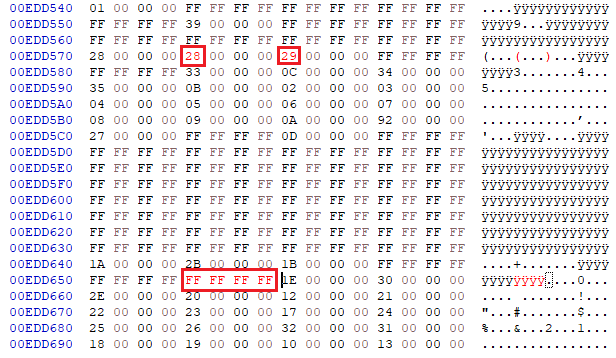

# Emulator Patches

## Fix FBNeo/MAME P1-L an P2-L buttons

Please note that:
- the emulator file to patch is ```/emus/fbneo/fbneo```
- if you also intend to use the "MAME" emulator even though it is a duplicate you can also patch ```/emus/mame/fbneo```
- there are [6 bytes to patch spread across three locations](https://github.com/nk64/GT4286/blob/main/img/fbneo-hexedit-fix-p1-r-and-l-buttons.png)

⚠️  Backup your SD Card before proceding!

Steps:
1. check that the SHA 256 Hash of your emulator file matches ```24B4026764C6B8F218D56222A534EDB3D21210A2C8FCDEE8A5F96505D6B85E9F```
2. Edit ```/emus/fbneo/fbneo``` modify the 6 bytes (in three locations) using a Hex-editor such as [HxD](https://mh-nexus.de/en/hxd/).



3. Check that the SHA 256 Hash of the emulator file now matches ```BB9DA0976667A3656EB851582B3D02D49253983E8A10FCBDBEAA47EB25F74282```
4. Repeat the procedure for the 'MAME' version in ```/emus/mame/fbneo```
5. Boot the console and load a 6 button game like ```Street Fighter II``` test that the P1-L and P1-R buttons now respond in a FBA game (and optionally in MAME). 
    * At this stage the buttons probably won't be in a nice order.
6. Copy (and rename) the ```fbneo.keymap.sf2+patchedemu``` file found [here](./sdcard_tweaks/keyremap/) to ```/keyremap/fbneo.keyremap```
7. Boot the console and try the arcade version of ```Street Fighter II``` and check that all six buttons are in the right order.
8. Report back your results in the [Button remap discusion](https://github.com/nk64/GT4286/discussions/9)