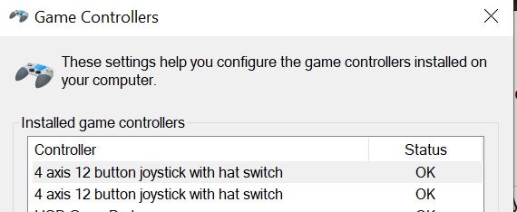
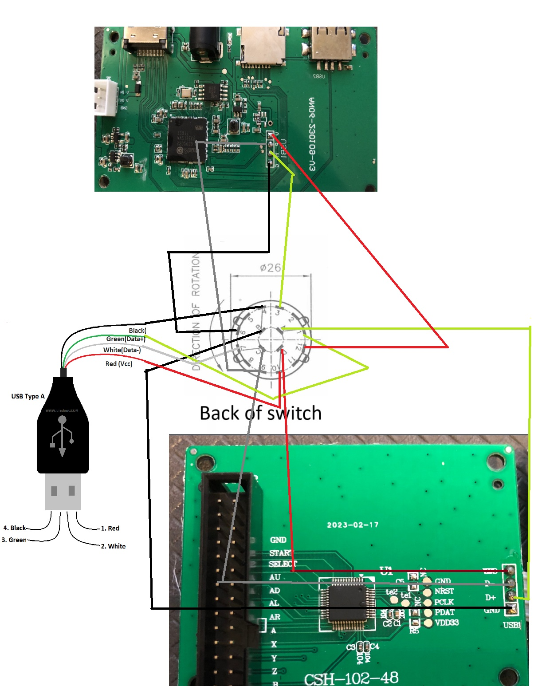

# Hardware Modifications

## Turn the GT4268 into a USB Controller
Please see [Original Post](https://www.ozbargain.com.au/comment/16111194/redir) by `ThighHighDemise`

> For those more interested in potentially picking one of these up to adapt into a usb controller to connect to an external PC (or raspberry pi/whatever else) instead of dealing with the included SOC, it's quite easy to accomplish. All the USB lines are clearly labelled on the IO board. Hooked up to a Linux/Windows PC shows up as two separate HID devices (p1/p2) and generic drivers work fine. For $50, I'm happy

> ... when you open it, there's two PCBs inside, one for the IO and the other for the actual computer. The IO board is pretty clearly labelled (I'll refer to nk64's github: https://github.com/nk64/GT4286/blob/main/img/hardware/io-boa… - right side of the PCB) with the four lines of a usb cable. You'll need to do some soldering to connect those 4 pads to either a female USB socket or you can hack up a USB cable. When you plug this into your computer two controllers are detected as a ```"Twin USB Gamepad"``` (Hardware ID ```USB\VID_0810&PID_0001``` for the curious, seems to be used in a lot of cheap PS2 -> USB converters).



> You could also rewire the buttons to an arcade USB io board if you didn't want to solder (eg. https://www.jaycar.com.au/usb-interface-for-joystick-and-but… - cheaper on ebay or aliexpress) but this would be a lot more involved.

### Snake eating its tail
[Original Post](https://www.ozbargain.com.au/comment/16133099/redir) by `YeahBabi`

> cut the cable between the 2 pcb's, then solder a usb cable to the joystick pcb.
Then just plug the male end of the cable to the back of the unit usb socket and use it normally.
No connection to pc, just boot the unit up and enjoy.

> If you want to use the controller for the pc, just disconnect the USB cable from the back of the unit and plug it into the pc, dont need to plug anything else in, so disconnect the power and disconnect the hdmi and just use it as a wired joystick.


### Rotary Switch Option
[Original Post](https://github.com/nk64/GT4286/discussions/22) by `Hello-dot-Jpg`




## Transplant boards from the GT4268 to [10" Screen](https://www.jaycar.com.au/10-inch-screen-raspberry-pi-retro-arcade-game-console/p/XC9064) in place of a Raspberry Pi

[Original Post](https://www.ozbargain.com.au/comment/16104576/redir)

> I did a tear down and inside is a PCB board, not an entry level raspberry pi. It runs Android according to boot up.
I did a disassembly of all parts, wires etc without damage. I removed my raspberry pi 4 I purchased separately from the 10” arcade gaming screen with joystick control and case from Jaycar when they had them on special at last sale for $64. It has a 10” screen, a power brick, HDMI, audio out port and a internal speaker.  
I will use the raspberry pi for another project.
Replaced original joystick and buttons in 10” gaming monitor with one from the $49 on sale today. Removed all wires from joystick 2 with a fine pin as they are not needed inside my case.  
I just need to fit PCB inside on bottom base with motherboard risers and drill holes in back of case for output ports that are on the back of PCB. Graphics look good in correct screen ratio without missing characters on screen or stretched graphics. One issue I encountered, sound is carried via the HDMI port but not working even know the 10” gaming case has HDMI in, a internal speaker, a speaker out port and hoping it may be just a setting in the menu on the 10” gaming unit. 


> Why would you replaced the joystick and buttons from this $49 machine and installed in another machine which already has very similar joystick and buttons? I mean the quality would be very similar right?

> Yes very similar only minor differences. Wiring harness has to be rewired or the joystick and buttons will not work as the negative and positive wires are in the opposite direction on the switches and the black block connector has to be rewired, it’s easier and quickest just to use the harness from the $49 machine.

> I encountered sound issue as stated in HDMI but might be a setting in the menu of the $64 arcade machine and have not worked it out as yet as i has internal speakers and audio out port. I am drilling holes in back of case for PCB outputs,
You need to take one button off at a time and rewire it correctly, I thought of taking photos of the wiring colour but it was easier and quicker to do one by one.


