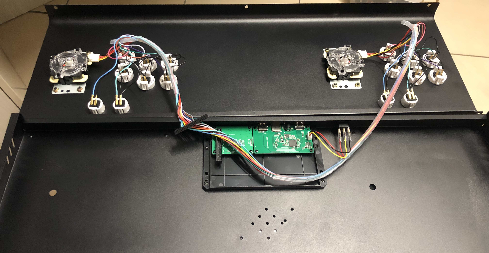
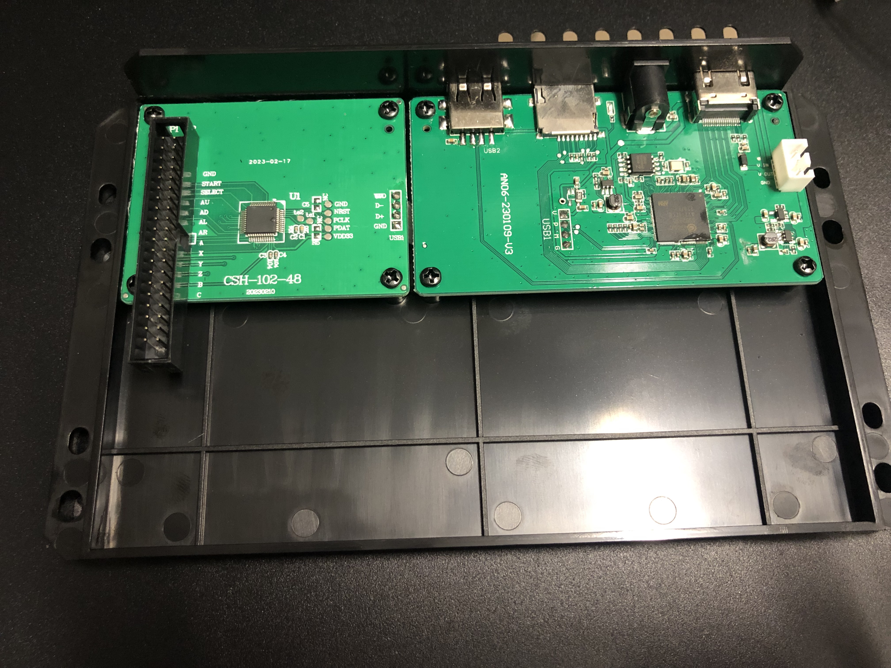
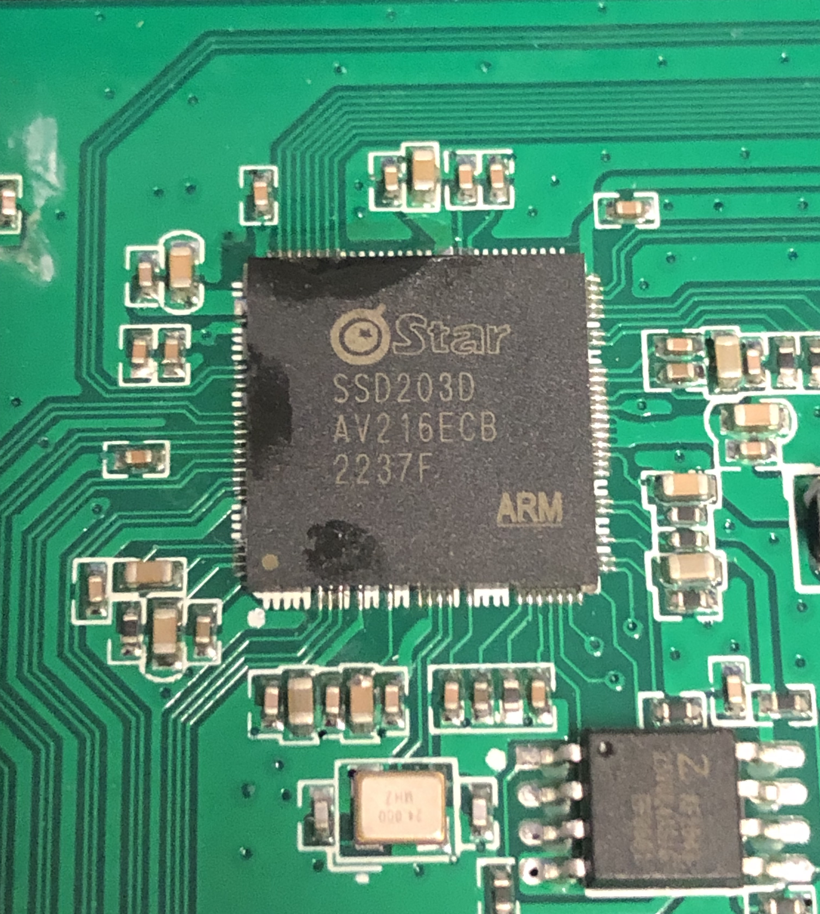
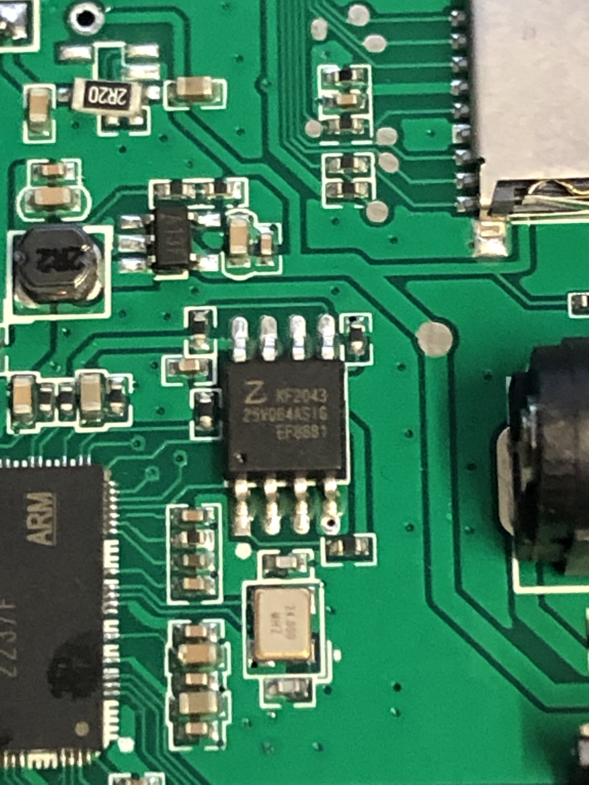

# Hardware

## Interesting Chips

### CPU / SOC
SigmaStar Technology SSD203D CPU
- Processor Core: ARM Cortex-A7 Dual Core
- Memory: 16bit 1Gb DDR3
- Package: QFN128
- Chip Markings: Star SSD203D AV216ECB 2237F ARM

Mentioned [here](https://linux-chenxing.org/)

### Flash
Zbit Semiconductor SPI 64Mb NOR Flash

[Datasheet](https://datasheet4u.com/datasheet-pdf/Zbit/ZB25VQ64/pdf.php?id=1553208)
- Product Family: 25=SPI Interface Flash
- Series: VQ=2.5V extended, 4KB Quad Mode
- Device Density: 64=64Mb
- Version: A=A Version
- Package Type: S=SOP8 208mil
- Temperature Range: I=Industrial(-40℃ to 85℃
- Green Code: G=Pb free and halogen
- Chip Markings: Z KF2043 25VQ64ASIG EF8887(?)

### IO Controller
No visible markings

## Pictures

### Inside the Console

### PCBs

### Main board (Front)
")

### Main board (Back)
")

### IO board (Front)
")

### IO board (Back)
")

### CPU Closeup

### Flash Closeup
